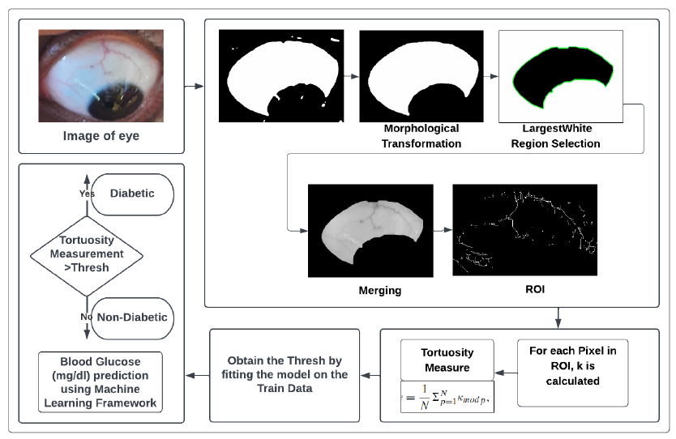
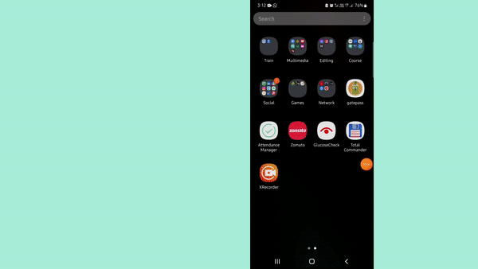

<H1 align =center>GLU-CAM </H1>
<p align =center>"Assessment of Glucose Level"</p>
<p align="center">
  
</p>


Glu-Cam is a web app for measuring blood glucose levels using a noninvasive method and an easy way to monitor blood glucose levels without expense. It uses the change in the curvature of eye veins, i.e., Tortuous Retinal Vasculature, which is a sign of diabetes in a person. We take the eye images of the eyes, extract the ROI, i.e., veins, and calculate the TRV values of both eyes. The glucose level is predicted by the average TRV value and the time of the last meal using an ML model.

# Features - 

1. Easy to Use.
2. Non-invasive, no need of blood droplet.
3. Does not require any separate hardware module.
4. Does not require internet connection.
5. Works with almost all android mobile devices as it was developed for mobile first.


# Technologies used:
 

 
 

 
 

# Proposed Methodology - 
As shown in the figure, the proposed methodology involves several steps to efficiently make a non-invasive method to predict the blood glucose level. The project implementation is divided into three-step pipelined architecture, as illustrated in Figure.

# The three steps involved are -
1. Extracting the Region of Interest -  The aim is to extract the region of interest from a digital eye image.
<p align ="center" >  src="images/2.png" alt="method"></p>
2. Tortuosity and Blood Glucose Measurement -
   2.1 The tortuosity measure refers to the degree of curvature or twisting of blood vessels within the ROI.
   2.2 This step involves leveraging the power of machine learning algorithms and techniques to analyze the extracted ROI and extract valuable information related to tortuosity and blood           glucose levels.
   2.3 The extracted blood vessel patterns and characteristics can be analyzed using machine learning frameworks to quantify the tortuosity level
3. Smartphone-based Implementation
  <p align ="center" > 
 </p>


# Apk Demo
 <p align ="center" >
  
  </p>

## Instructions for running the application

Clone the repository:
```zsh
git clone https://github.com/Vinayak2002/GFG_Hackathon.git
```

Create a new virtual environment and activate it.

Install all required python packages :
```zsh
pip install -r requirements.txt
```

Add the Secret Key in the settings.py file.

Run the application :
```python
python manage.py runserver
```
---

Made with :heart: at IIIT Naya Raipur
